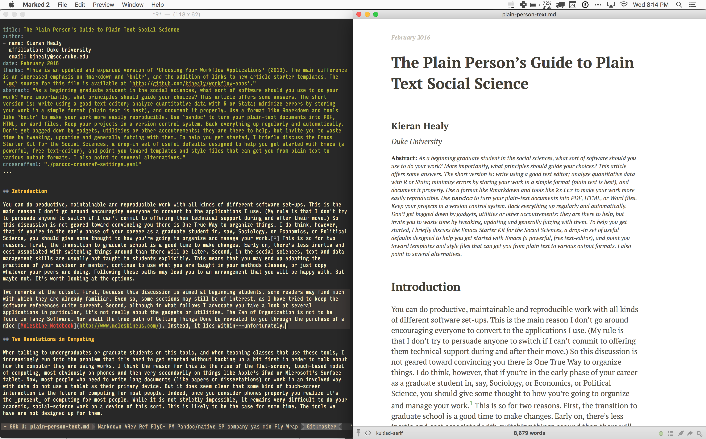
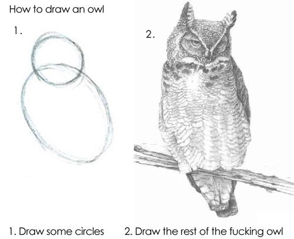
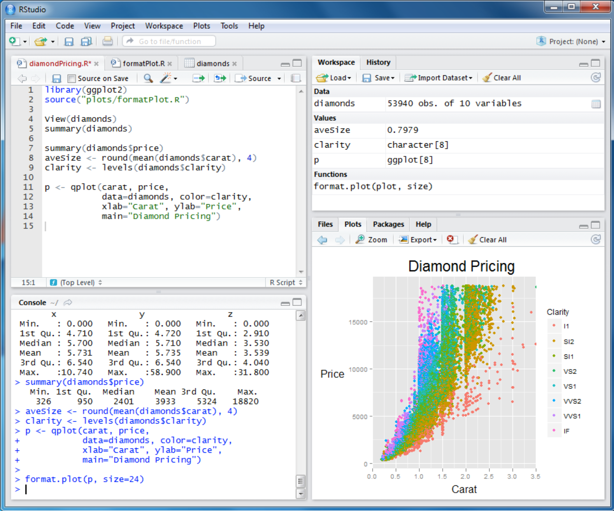

title: "A Pandoc Markdown Article Starter"
author:
- name: Kieran Healy
  affiliation: Duke University
  email: kjhealy@soc.duke.edu
- name: Joe Bloggs
  affiliation: University of North Carolina, Chapel Hill
  email: joebloggs@unc.edu
date: January 2014
abstract: "Lorem ipsum dolor sit amet."
...

# Introduction
Lorem ipsum dolor sit amet, consectetur adipisicing elit, 
sed do eiusmod tempor incididunt ut labore et dolore magna 
aliqua [@fourcade13classsituat]. Notice that citation.

# Theory
Lorem ipsum dolor sit amet, consectetur adipisicing 
elit, sed do eiusmod tempor incididunt ut labore et 
dolore magna aliqua [@fourcade13classsituat].
```

Let's start with a straightforward markdown file---no R code yet, so nothing to the left of `article.md` line in @fig:workflow-diagram. The start of the sample `article-markdown.md` file is shown in @lst:yamlheader. The bit at the top is metadata, which pandoc understands. The HTML and LaTeX templates [in the pandoc-templates repository](https://github.com/kjhealy/pandoc-templates/tree/master/templates) are set up to use this metadata properly. Pandoc will take care of the citations directly. There is more than one way to have pandoc manage citations, but here we just use the most self-contained route. Simple documents can be contained in a single `.md` file. Documents including data analysis start life as `.Rmd` files which are then knitted into `.md` files and converted to PDF or HTML. At its simplest, a `mypaper.md` document can be converted to `mypaper.pdf` file by opening a terminal window and typing a command like the one in @lst:pandocsimple.

```{#lst:pandocsimple .sh caption="The simplest way to convert a Markdown file to PDF with pandoc"}
pandoc mypaper.md -o mypaper.pdf
```


Because we will probably run commands like this a lot, it's convenient to automate them a little bit, and to add some extra bells and whistles to accommodate things we will routinely add to files, such as author information and other metadata, together with the ability to process bibliographic information and cross-references. These are handled by `pandoc` by turning on various switches in the command, and by ensuring a couple of external "filters" are present to manage the bibliographies and cross-references. Rather than type long commands out repeatedly, we will automate the process. This kind of automation is especially useful when our final output file might have a number of prerequisites before it can be properly produced, and we would like the computer to be a little bit smart about what needs to be re-processed and under what conditions. That way, for example, if a Figure has not changed we will not re-run the (possibly time-consuming) R script to create it again, unless we have to.

We manage this process using a tool called [`make`](https://www.gnu.org/software/make/). Inside our project folder we put a plain-text `Makefile` that contains some rules governing how to produce a _target_ file that might have a number of _prerequisites_. In this case, a PDF or HTML file is the target, and the various figures and data tables are the prerequisites---if the code that produces the prerequisites changes, the final document will change too. `Make` starts from the final document and works backwards along the chain of prerequisites, re-compiling or re-creating them as needed. It's a powerful tool. For a good basic introduction, take a look at Karl Broman's "[Minimal Make](http://kbroman.org/minimal_make/)". (Incidentally, Karl Broman has [a number of tutorials and guides](http://kbroman.org/pages/tutorials) providing accurate and concise tours of many of the tools and topics described here, including [getting started with reproducible research](http://kbroman.org/steps2rr), [using git and GitHub](http://kbroman.org/github_tutorial), and [working with knitr](http://kbroman.org/knitr_knutshell).)

Following Karl Broman's example, let's imagine that you have a paper, `paper.md` written in Markdown, that incorporates references to a figure, `fig1.pdf` generated by an R script, `fig1.r`. You could of course have an `.Rmd` file that produces the output, but there are situations where that isn't ideal. The end-point or target is the full article in PDF form. When the text of the paper changes in `paper.md`, then `paper.pdf` will have to be re-created. In the same way, when we change the content of `fig1.r` then `fig1.pdf` will need to be updated, and thus also `paper.pdf` will need to be re-created as well. Using `make` we can take care of the process. 

Here is what a basic `Makefile` for our example would look like:

```{#lst:makesimple .bash caption="A simple Makefile"}

## Read as "mypaper.pdf depends on mypaper.md and fig1.pdf"
mypaper.pdf: mypaper.md fig1.pdf 
    pandoc mypaper.md -o mypaper.pdf

## Read as "fig1.pdf depends on fig1.r"
fig1.pdf: fig1.r
    R CMD BATCH fig1.r

```

The big gotcha for `Makefiles` is that for no good reason they use the `<TAB>` key rather than spaces to indent the commands associated with rules. If you use spaces, `make` will not work. With the `Makefile` in @lst:makesimple, typing `make` at the command line will have make check the state of the final target (`makefile.pdf`) and all its dependencies. If the target isn't present, `make` will create it in accordance with the rules specified. If the target *is* present, `make` will check to see if any of its prerequisites have changed since it was last created. If so, it will recreate the file. The chain of prerequisites propagates backwards, so that if you change `fig1.r`, then `make` will notice and re-run it to create `fig1.pdf` before running the commands in the rule to create `mypaper.pdf`. You can also choose to just invoke single rules from the makefile, e.g. by typing `make fig1.pdf` instead of `make` at the command line. This will evaluate just the `fig1.pdf` rule and any associated prerequisites. 

For a simple example like this, make is mostly a minor convenience, saving you the trouble of typing a sequence of commands over and over to create your paper. However, it becomes very useful once you have projects with many documents and dependencies---for example, a dissertation consisting of separate chapters, each of which contains figures and tables, which in turn depend on various R scripts to set up and clean data. In those cases, `make` becomes a very powerful and helpful way of ensuring your final output really is up to date. 

To deal with more complex projects and chains of prerequisites, `make` can make use of a number of variables to save you from (for example) typing out the name of every `figure-x.pdf` in your directory. 

The `Makefile` in the sample [`md-starter` project](https://github.com/kjhealy/md-starter) will convert any markdown files in the working directory to HTML, `.tex`, `.pdf`, or `.docx` files as requested. Typing `make html` at the command line will produce `.html` files from any `.md` files in the directory, for example. The PDF output (from `make pdf`) will look like this article, more or less. The different pieces of the `Makefile` define a few variables that specify the relationship between the different file types. In essence the rules say, for example, that all the PDF files in the directory depend on changes to an `.md` file with the same name; that the same is true of the HTML files in the directory, and so on. Then the  show the `pandoc` commands that generate the output files from the markdown input. The Makefile itself is shown in @lst:makefile makes use of a few variables as shorthand, as well as special variables like `$@` and `$<`, which mean "the name of the current target" and "the name of the current prerequisite", respectively.

```{#lst:makefile .bash caption="A more complicated Makefile"}
## Extension (e.g. md, markdown, mdown).
## for all markdown files in the directory
MEXT = md

## Variable expands to a list of all markdown files 
## in the working directory
SRC = $(wildcard *.$(MEXT))

## Location of Pandoc support files.
PREFIX = /Users/kjhealy/.pandoc

## Location of your working bibliography file
BIB = /Users/kjhealy/Documents/bibs/socbib-pandoc.bib

## CSL stylesheet (located in the csl folder of the PREFIX directory).
CSL = apsa

## x.pdf depends on x.md, x.html depends on x.md, etc
PDFS=$(SRC:.md=.pdf)
HTML=$(SRC:.md=.html)
TEX=$(SRC:.md=.tex)
DOCX=$(SRC:.md=.docx)

## Rules -- make all, make pdf, make html. The `clean` rule is below.
all:	$(PDFS) $(HTML) $(TEX) $(DOCX)
pdf:	clean $(PDFS)
html:	clean $(HTML)
tex:	clean $(TEX)
docx:	clean $(DOCX)

## The commands associated with each rule.
## This first one is run when `make html` is typed.
## Read the rule as "When making the html file, 
## run this pandoc command if the .md file has changed."
%.html:	%.md
	pandoc -r markdown+simple_tables+table_captions+yaml_metadata_block \ 
    -w html -S --template=$(PREFIX)/templates/html.template \
    --css=$(PREFIX)/marked/kultiad-serif.css --filter pandoc-crossref \     
    --filter pandoc-citeproc --csl=$(PREFIX)/csl/$(CSL).csl \ 
    --bibliography=$(BIB) -o $@ $<

## Same goes for the other file types. Watch out for the TAB before 'pandoc'
%.tex:	%.md
	pandoc -r markdown+simple_tables+table_captions+yaml_metadata_block \ 
    --listings -w latex -s -S --latex-engine=pdflatex \ 
    --template=$(PREFIX)/templates/latex.template \ 
    --filter pandoc-crossref --filter pandoc-citeproc \ 
    --csl=$(PREFIX)/csl/ajps.csl --filter pandoc-citeproc-preamble \ 
    --bibliography=$(BIB) -o $@ $<

%.pdf:	%.md
	pandoc -r markdown+simple_tables+table_captions+yaml_metadata_block \ 
    --listings -s -S --latex-engine=pdflatex \ 
    --template=$(PREFIX)/templates/latex.template \ 
    --filter pandoc-crossref --filter pandoc-citeproc \ 
    --csl=$(PREFIX)/csl/$(CSL).csl --filter pandoc-citeproc-preamble \ 
    --bibliography=$(BIB) -o $@ $<

%.docx:	%.md
	pandoc -r markdown+simple_tables+table_captions+yaml_metadata_block \ 
    -s -S --filter pandoc-crossref --csl=$(PREFIX)/csl/$(CSL).csl \ 
    --bibliography=$(BIB) -o $@ $<

clean:
	rm -f *.html *.pdf *.tex *.aux *.log *.docx

.PHONY: clean
```

Note that the `pandoc` commands are interpreted single lines of text, not several lines separated by the `<return>` key. But you can use the `\` symbol to tell `make` to continue to the next line without a break. With this Makefile,  typing `make pdf` would take all the `.md` files in the directory one at a time and run the pandoc command to turn each one into a PDF, using the [APSR](https://www.apsanet.org/utils/journal.cfm?Journal=APSR) reference style, my latex template, and a `.bib` file called `socbib-pandoc.bib`.

You shouldn't use this `Makefile` blindly. Take the time to learn how `make` works and how it can help your project. The [official manual](https://www.gnu.org/software/make/manual/) is pretty clear. Make's backward-looking chain of prerequisites can make it tricky to write rules for complex projects. When writing or inspecting a `Makefile` and its specific rules, it can be helpful to use the `--dry-run` switch, as in `make --dry-run`. This will print out the sequence of commands `make` would run, but without actually executing them. You can try this with the `Makefile` in @lst:makefile in a directory with at least one `.md` file in it. For example, look at the list of commands produced by `make pdf --dry-run` or `make docx --dry-run` or `make clean --dry-run`.

The particular steps needed for many projects may be quite simple, and
not require the use of any variables or other frills. If you find
yourself repeatedly running the same sequence of commands to assemble
a document (e.g. cleaning data; running preliminary code; producing
figures; assembling a final document) then `make` can do a lot to
automate the process. For further examples of `Makefiles` doing things relevant to data analysis, see [Lincoln Mullen's discussion](http://lincolnmullen.com/blog/makefiles-for-ocr-and-converting-shapefiles) of the things he uses `make` to manage.

The particular steps needed for many projects may be quite simple, and not require the use of any variables or other frills. If you find yourself repeatedly running the same sequence of commands to assemble a document (e.g. cleaning data; running preliminary code; producing figures; assembling a final document) then `make` can do a lot to automate the process.

The examples directory [includes](https://github.com/kjhealy/pandoc-templates/blob/master/examples/article-knitr.Rmd) a sample `.Rmd` file. The code chunks in the file provide examples of how to generate tables and figures in the document. In particular they show some useful options that can be passed to knitr. [Consult the `knitr` project page](http://yihui.name/knitr/) for extensive documentation and many more examples. To produce output from the `article-knitr.Rmd` file, you could of course launch R in the working directory, load `knitr`, and process the file. This produces the `article-knitr.md` file, together with some graphics in the `figures/` folder (and some working files in the `cache/` folder). We set things up in the `.Rmd` file so that `knitr` produces both PNG and PDF versions of whatever figures are generated by R. That prepares the way for easy conversion to HTML and LaTeX. Once the `article-knitr.md` file is produced, HTML, `.tex`, and PDF versions of it can be produced as before, by typing `make` at the command line. But of course there's no reason `make` can't automate that first step, too. The [`rmd-starter` project](http://github.com/kjhealy/rmd-starter) has a sample `Makefile` that begins with the `.Rmd` files in the directory and produces the outputs from there.


### Using Marked

In everyday use, I find Brett Terpstra's application [Marked](http://marked2app.com) to be a very useful way of previewing text while writing. Marked shows you your Markdown files as HTML, updating the preview on the fly whenever changes are saved in the Markdown file. It can render ordinary Markdown by default, but it also supports `pandoc` as a custom processor. This means it can manage the various extra bells and whistles of scholarly formatting discussed so far. Essentially, you tell Marked run a `pandoc` command similar or identical the one shown above to generate its HTML previews. You do this in the "Advanced" tab of Marked's preferences. The "Path" field in the preferences dialog contains the full path to `pandoc`, and the "Args" field contains all the relevant command switches---in my case, the same as in the Makefile above.

When editing your markdown file in your favorite text editor, you point Marked at the file and get a live preview. You can add the [CSS files in the pandoc-templates repository](https://github.com/kjhealy/pandoc-templates/blob/master/marked/kultiad-serif.css) to the list of Custom CSS files Marked knows about, via the "Style" tab in the Preferences window. That way, Marked's preview will look the same as the HTML file that's produced. @fig:marked-example shows what this looks like in practice. 

{#fig:marked-example}

The upshot of all of this is powerful editing using Emacs, [ESS](http://ess.r-project.org), R, and other tools; flexible conversion using pandoc; quick and easy previewing via HTML and Marked; and high-quality PDF typesetting at the same time (or whenever needed). All of it can be generated directly from plain text, and will include almost all of the machinery most scholarly papers need, most notably properly labeled Tables and Figures that can be cross-referenced in the text. While it all may seem quite complex when laid out in this way, in use it is quite straightforward, and doesn't require any thought when in use. I just live in my text editor. The various scripts and settings do their work quietly, and I get the formatted output I want. 

### An Emacs Starter Kit 

A step-by-step guide to downloading and installing every piece of software I've mentioned so far is beyond the scope of this discussion. But let's say you take the plunge and download Emacs, a TeX distribution, R, and maybe even Git. Now what? If you're going to work in Emacs, there are a variety of tweaks and add-ons that are very helpful but not set by default. To make things a little easier, I maintain an [Emacs Starter Kit for the Social Sciences](http://kjhealy.github.com/emacs-starter-kit/). It's designed to smooth out Emacs' rough edges by giving you a drop-in collection of default settings, as well as automatically installing some important add-on packages. It will, I hope, help you skirt the abyss of Setting Things Up Forever.

## Do I Have to Use All this Stuff?

{#fig:owl}

> Installation/setup/whatever is always harder and much more poorly documented than mere usage --- [Jenny's Law](https://twitter.com/JennyBryan/status/699462966282858500)

### Pros and Cons

Running your data analysis in R, writing documents in Markdown or RMarkdown, doing both inside Emacs, processing them with `pandoc`, tracking things with Git and using (behind the scenes) various Unix tools and LaTeX ... this all sounds rather complicated. It has four main advantages. First, these formats, tools, and applications are all free. You can try them out without much in the way of monetary expense. (Your time may be a different matter, but although you don't believe me, you have more of that now than you will later.) Second, they are all open-source projects and are all available for Mac OS X, Linux and Windows. Portability is important, as is the long-term viability of the platform you choose to work with. If you change your computing system, your work can move with you easily. Third, they allow you to do your work in a portable, documented, and reproducible way. And fourth, the applications are closely integrated. Everything (including version control) can work inside Emacs. All of them can work directly with or take advantage of the others.

None of these tools is perfect. They can do very useful and important things for you, but they are not magic. There are bad habits associated with working in plain text, just as there are bad habits associated with writing everything in word. These tools are powerful, but they can be tedious to learn. However, you don't have to start out using all of them at once, or learn everything about them right away---the only thing you really, *really* need to start doing *immediately* is keeping good backups. There are a number of ways to try these tools out in whole or in part. You could try writing something in Markdown first, using any text editor. You could begin using R with [RStudio](http://rstudio.com). Revision control is more beneficial when implemented at the beginning of projects, and best of all when committing changes to a project becomes a habit of work. But it can be added at any time.

You are not condemned to use these applications forever, either. RMarkdown and (especially) Markdown documents can be converted into many other formats. Your text files are editable in any other text editor and on any other computer. Statistical code is by nature much less portable, but the openness of R means that it is not likely to become obsolete or inaccessible any time soon. In everyday use, you may find that documents start life as plain-text, Markdown-formatted notes jotted down on your phone, or computer; then they become longer `.md` files that grow references and figures and so on; and eventually migrate to Word or Google Docs or something similar if you acquire a collaborator or the time comes to submit a manuscript to a journal. 

A disadvantage of these particular applications is that I'm in a minority with respect to other people in my field. This is less and less true in the case of R, and more recently with tools like Git as well. Writing papers in RMarkdown or Markdown is less common. Most people use Microsoft Word to write papers, and if you're collaborating with people (people you can't boss around, I mean) this can be an issue. It is usually easier to use applications like Word than convert people to a plain-text workflow. If you do, at least try and implement some of the principles discussed here when it comes to tracking changes to documents and managing the code and output of your data analysis.

### Alternatives Might Be Better

There are many other applications you might put at the center of your workflow, depending on need, personal preference, willingness to pay some money, or desire to work on a specific platform. For text editing, especially, there is a plethora of choices. On the Mac, quality editors include [BBEdit](http://www.barebones.com/products/bbedit/index.shtml) (beloved of many web developers, but with relatively little support for R beyond syntax highlighting), and [TextMate 2](http://macromates.com/download) (shown in @fig:tm). On Linux, the standard alternative to Emacs is [vi](http://www.eng.hawaii.edu/Tutor/vi.html) or [Vim](http://www.vim.org/), but there are many others. For Windows there is [Textpad](http://www.textpad.com/), [WinEdt](http://www.winedt.com/), [UltraEdit](http://www.ultraedit.com/), and [NotePad++](http://notepad-plus.sourceforge.net/uk/site.htm) amongst many others. Most of these applications have strong support for LaTeX and some also have good support for statistics programming.

{#fig:tm}

[Sublime Text 3](http://www.sublimetext.com/) is a cross-platform text editor under active development, and with an increasingly large user base. Sublime Text is fast, fluid, and contains a powerful plugin system based on the [Python](http://python.org) programming language. Uniquely amongst alternatives to Emacs and ESS, Sublime Text includes a well-developed [REPL](http://en.wikipedia.org/wiki/Read%E2%80%93eval%E2%80%93print_loop) that allows R to be run easily inside the editor.[^9] Sublime Text costs \$70.

Finally, and as noted throughout this article, for a different approach to working with R you should consider [RStudio](http://www.rstudio.com). A screenshot is shown in @fig:rstudio. Although it appears quite late in this discussion, it might well be your first choice. I use it when teaching. It is not a text editor but rather an "IDE", an integrated development environment. Your code and figures, together with an R console, documentation, and other output are all displayed in different panes and tabs of RStudio's application window. Data and script files are managed via various windows and menus. RStudio is available for Mac OS X, Windows, and Linux. It intergrates nicely with R's help files. It understands `knitr` and Git. As discussed above, it has full support for Rmarkdown and generates HTML, PDF, and other formats for you very easily. It is the easiest way by far to get into using R, and provides a straightforward way to manage many of the tools already discussed here.

{#fig:rstudio}

For statistical analysis in the social sciences, the main alternative to R is [Stata](http://www.stata.com/). Stata is not free, but like R it is versatile, powerful, extensible and available for all the main computing platforms. It has a large body of user-contributed software. In recent versions its graphics capabilities have improved a great deal, as has its editor. ESS can highlight Stata `.do` files in the same way as it can do for R. Other editors can also be made to work with Stata. More recently, [Python](http://python.org) has been coming into frequent use in the social sciences. Python is a general-purpose computing language that is relatively straightforward to learn. It is often used for manipulating, cutting, and cleaning data prior to analysis in applications like R or Stata. But it is also increasingly a scientific computing platform in its own right. [SciPy](http://www.scipy.org) is a useful place to begin learning about Python's capabilities on this front. Like R and RMarkdown, it has good support for literate programming through tools like [iPython Notebooks](http://ipython.org/notebook.html). Naturally, Emacs has good support for working with Python.

Amongst social scientists, revision control is perhaps the least widely-used of the tools I have discussed. But I am convinced that it is the most important one over the long term. While tools like Git take a little getting used to both conceptually and in practice, the services they provide are extremely useful. It is already quite easy to use version control in conjunction with most of the text editors discussed above. There are also full-featured clients like [Tower](https://www.git-tower.com) that allow you to administer git without having to use the command line. Taking a longer view, version control is likely to become more widely available through intermediary services or even as part of the basic functionality of operating systems.

## A Broader Perspective

It would be nice if all you needed to do your work was a box software of software tricks and shortcuts. But of course it's a bit more complicated than that. In order to get to the point where you can write a paper, you need to be organized enough to have read the right literature, maybe collected some data, and most importantly asked an interesting question in the first place. No amount of software is going to solve those problems for you. Too much concern with the details of your setup hinders your work. Indeed---and I speak from experience here---this concern is itself a kind self-imposed distraction that placates work-related anxiety in the short term while storing up more of it for later.[^10] On the hardware side, there's the absurd productivity counterpart to the hedonic treadmill, where for some reason it's hard to get through the to-do list even though the cafe you're at contains more computing power than was available to the Pentagon in 1965. On the software side, the besetting vice of software is the tendency to waste a lot of your time installing, updating, and generally obsessing about it.[^11] Even more generally, efficient workflow habits are themselves just a means to the end of completing the projects you are really interested in, of making the things you want to make, of finding the answers to the questions that brought you to graduate school. The process of idea generation and project management can be run well, too, and perhaps even the business of choosing what the projects should be in the first place. But this is not the place---and I am not the person---to be giving advice about that.

All of which is just to reiterate two things. First, I am not advocating these tools on the grounds that they will make you more "productive". Rather, they may help you stay in control of---and able to reproduce---your own prior work. That is an important difference. If you care about getting the right answer in your data analysis, or at least being able to repeatedly get the same probably wrong answer, then tools that enhance this sort of control should appeal to you. Second, even with that caveat it is still the *principles* of workflow management that are important. The software is just a means to an end. One of the [smartest, most productive people I've ever known](http://en.wikipedia.org/wiki/David_Kellogg_Lewis) spent half of his career writing on a typewriter and the other half on an ancient [IBM Displaywriter](http://www-03.ibm.com/ibm/history/exhibits/pc/pc_8.html). His backup solution for having hopelessly outdated hardware was to keep a spare Displaywriter in a nearby closet, in case the first one broke. It never did.


## Appendix: Links to Resources


### Basic Tools
- [Apple's Developer Tools](https://developer.apple.com/library/ios/technotes/tn2339/_index.html) Unix toolchain. Install directly with `xcode-select --install`, or just try to use e.g. `git` from the terminal and have OS X prompt you to install the tools.
- [Homebrew package manager](http://brew.sh). A convenient way to install several of the tools here, including Emacs and Pandoc.
- [Emacs](http://www.gnu.org/software/emacs/). A powerful text editor. Ready-to-go Mac version at [Emacs for Mac OS X](http://emacsformacosx).
- [R](http://r-project.org). A platform for statistical computing.
- [knitr](http://yihui.name/knitr/). Reproducible plain-text documents from within R. 
- [Python](http://python.org) and [SciPy](http://www.scipy.org/). Python is a general-purpose programming language increasingly used in data manipulation and analysis.
- [RStudio](http://rstudio.com). An IDE for R. The most straightforward way to get into using R and RMarkdown.
- [TeX and LaTeX](http://tug.org). A typesetting and document preparation system. You can write files in `.tex` format directly, or you can just have it available in the background for other tools to use. The [MacTeX Distribution](http://tug.org/mactex) is the one to install for OS X.
- [Pandoc](http://pandoc.org). Converts plain-text documents to and from a wide variety of formats. Can be installed with Homebrew. Be sure to also install `pandoc-citeproc` for processing citations and bibliographies, and `pandoc-crossref` for producing cross-references and labels.
- [Git](http://git-scm.org). Version control system. Installs with Apple's Developer Tools, or get the latest version via Homebrew.
- [GNU Make](http://www.gnu.org/software/make). You tell `make` what the steps are to create the pieces of a document or program. As you edit and change the various pieces, it automatically figures out which pieces need to be updated and recompiled, and issues the commands to do that. See Karl Broman's [Minimal Make](http://kbroman.org/minimal_make/) for a short introduction. Make will be installed automatically with Apple's developer tools.
- [lintr](https://github.com/jimhester/lintr) and [flycheck](https://github.com/flycheck/flycheck). Tools that nudge you to write neater code.

### Helpers and Templates
- [Emacs Starter Kit for the Social Sciences](http://kjhealy.github.com/emacs-starter-kit/). Set Emacs up to use many of the tools described in this guide.
- [Pandoc Templates](https://github.com/kjhealy/pandoc-templates). LaTeX and HTML templates, together with Pandoc configuration files and other things needed to produce good-looking PDF, HTML, and Word documents from plain text sources using Pandoc.
- [`md-starter` project](https://github.com/kjhealy/md-starter) and [`rmd-starter` project](https://github.com/kjhealy/rmd-starter). Assuming you have the tools and Pandoc/LaTeX templates installed, these skeleton project folders contain a basic `.md` or `.rmd` starter file and a `Makefile` to produce `.html`, `.tex`, `.pdf` and `.docx` files as described in this guide.
- [RMarkdown Cheatsheet](https://www.rstudio.com/wp-content/uploads/2015/02/rmarkdown-cheatsheet.pdf) An overview of Markdown and RMarkdown conventions.
- [RStudio Cheatsheets](https://rstudio.com/resources/cheatsheets/) Other quick guides, including a more comprehensive RMarkdown reference and a information about using RStudio's IDE, and some of the main tools in R.

### Guides

- [R Style Guide](http://adv-r.had.co.nz/Style.html). Write readable code.
- [knitr](http://yihui.name/knitr/demos) Documentation and examples for `knitr` by its author, Yihui Xie. There is also a [knitr book](http://www.amazon.com/dp/1498716962/) covering the same ground in more detail.
- [Rmarkdown documentation](http://rmarkdown.rstudio.com) from the makers of RStudio. Lots of good examples.
- [Plain Person's Guide](http://github.com/kjhealy/plain-text.co) The git repository for this project.
- [Jenny Bryan's Stat 545](http://stat545-ubc.github.io/topics.html). Notes and tutorials for a Data Analysis course taught by [Jennifer Bryan](http://www.stat.ubc.ca/~jenny/) at the University of British Columbia. Lots of useful material.
- [Karl Broman's Tutorials and Guides](http://kbroman.org/pages/tutorials) Accurate and concise guides to many of the tools and topics described here, including [getting started with reproducible research](http://kbroman.org/steps2rr), [using git and GitHub](http://kbroman.org/github_tutorial), and [working with knitr](http://kbroman.org/knitr_knutshell).
- [Makefiles for OCR and converting Shapefiles](http://lincolnmullen.com/blog/makefiles-for-ocr-and-converting-shapefiles). Some further examples of `Makefiles` in the data-analysis pipeline, by [Lincoln Mullen](http://lincolnmullen.com)
    
### Paid Applications and Services
- [Backblaze](http://backblaze.com). Secure off-site backup.
- [Crashplan](http://crashplan.com). Secure off-site backup.
- [GitHub](http://github.com). Host public Git repositories for free. Pay to host private ones. Also a source for publicly available code (e.g. R packages and utilities) written by other people.
- [Marked 2](http://marked2app.com). Live HTML previewing of Markdown documents. Mac OS X only.
- [Sublime Text](http://sublimetext.com). Python-based text editor.
- [Zotero](http://zotero.org), [Mendeley](http://mendeley.com), and [Papers](http://papersapp.com) are citation managers that incorporate PDF storage, annotation and other features. Zotero is free to use. Mendeley has a premium tier. Papers is a paid application after a trial period. I don't use these tools much, but that's not for any strong principled reason---mostly just intertia. If you use one and want to integrate with the material here, just make sure it can export to BibTeX/BibLaTeX files. Papers, which I've used most recently, can handily output citation keys in pandoc's format amongst several others.


[^1]: This may also be true if you are about to move from being a
    graduate student to starting as a faculty member, though perhaps the
    rationale is less compelling given the costs.


[^3]: For further argument about the advantages of text-editors over
    word processors see Allin Cottrell's polemic, \`\`[Word Processors:
    Stupid and Inefficient](http://www.ecn.wfu.edu/~cottrell/wp.html).''


[^4]: The actual business of *giving* talks based on your work is beyond
    the scope of this discussion. Suffice to say that there is plenty of
    good advice available via Google, and you should pay attention to
    it.

[^9]: TextMate also has some support for this way of working, but it is
    conceived and accomplished a little differently.

[^10]: See [Merlin Mann](http://inboxzero.com/), amongst others, for
    more on this point.

[^11]: Mike Hall's brilliant "[Org-Mode in your Pocket is a GNU-Shaped
    Devil](http://mph.puddingbowl.org/2010/02/org-mode-in-your-pocket-is-a-gnu-shaped-devil/)"
    makes this point very well.

[^commandline]: Here's how. Open a terminal window and type `xcode-select --install`. You can install `pandoc` and many other tools using the [Homebrew package manager](http://brew.sh).
