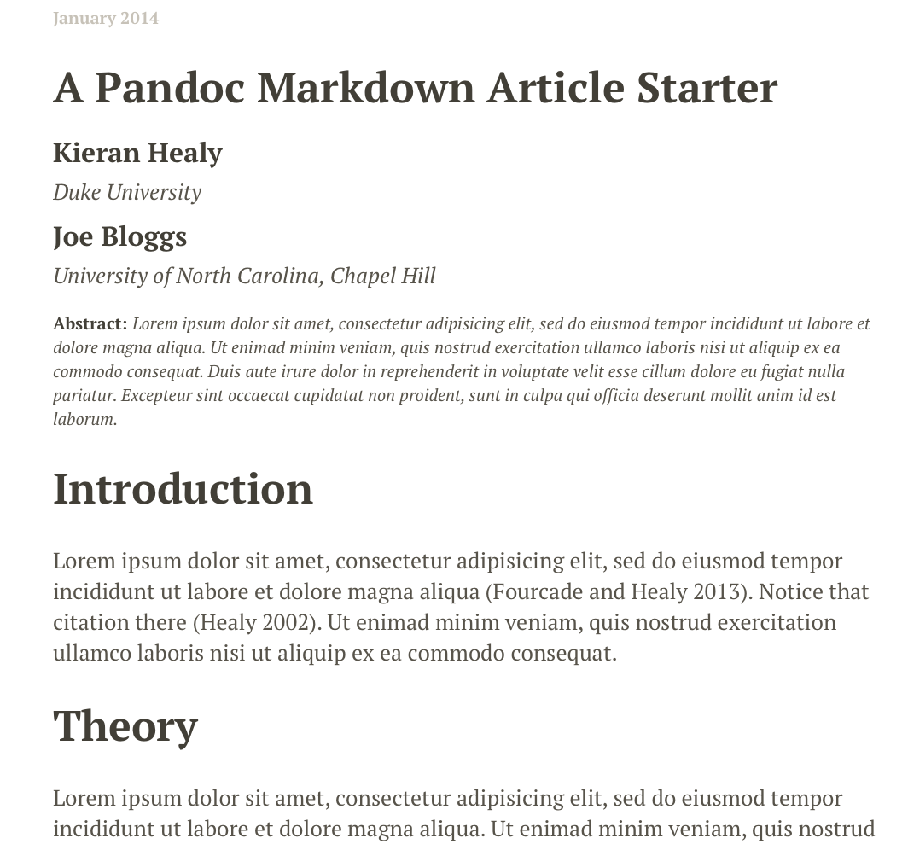
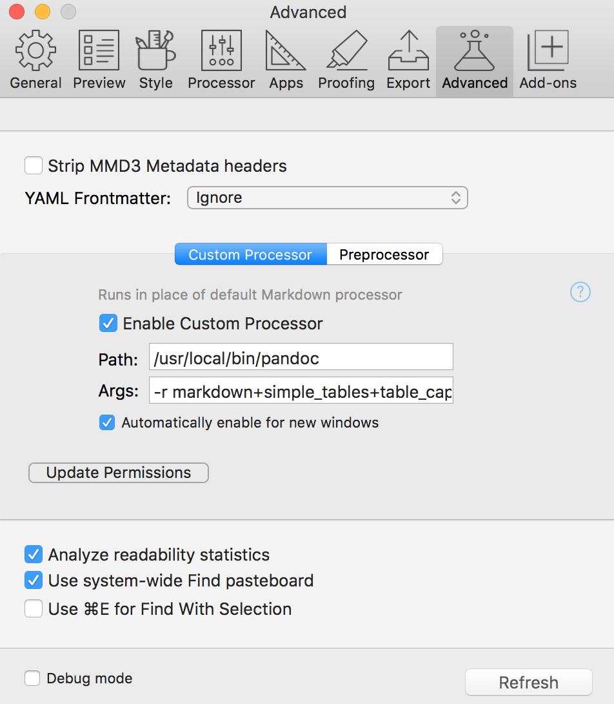

title: "A Pandoc Markdown Article Starter"
author:
- name: Kieran Healy
  affiliation: Duke University
  email: kjhealy@soc.duke.edu
- name: Joe Bloggs
  affiliation: University of North Carolina, Chapel Hill
  email: joebloggs@unc.edu
date: January 2014
abstract: "Lorem ipsum dolor sit amet"
bibliography: <!-- \bibliography{/Users/kjhealy/Documents/bibs/socbib-pandoc.bib} -->
...

# Introduction
Lorem ipsum dolor sit amet, consectetur adipisicing elit, 
sed do eiusmod tempor incididunt ut labore et dolore magna 
aliqua [@fourcade13classsituat]. Notice that citation.

# Theory
Lorem ipsum dolor sit amet, consectetur adipisicing 
elit, sed do eiusmod tempor incididunt ut labore et 
dolore magna aliqua [@fourcade13classsituat].

~~~~~~~

The bit at the top is YAML metadata, which pandoc understands. The
HTML and latex templates
[in the pandoc-templates repository](https://github.com/kjhealy/pandoc-templates/tree/master/templates)
are set up to use this metadata properly. Pandoc will take care of the
citations directly. There is more than one way to have pandoc manage
citations, but here we just use the most self-contained route. (The
`bibliography` line is not needed by pandoc at all: it is a hack to
allow RefTeX to easily insert citations in the document while editing
in Emacs.) 

Simple documents can be contained in a single `.md` file. Documents
including data analysis start life as `.Rmd` files which are then
knitted into `.md` files and converted to PDF or HTML. I use a
[Makefile](http://kbroman.org/minimal_make/) to control this process.
Make is a command-line tool that manages the production of a file (the
_target_) that has a number of _prerequisites_. In this case, the PDF
or HTML file is the target, and the various figures and data tables
are the prerequisites---if the code that produces them changes, the
final document will change too. `Make` starts from the final document
and works backwards along the chain of prerequisites, re-compiling or
re-creating them as needed. It's a powerful tool. The
[Makefile](https://github.com/kjhealy/pandoc-templates/blob/master/examples/Makefile)
in the examples directory will convert any markdown files in the
working directory to HTML, .tex, and PDF output. Just type `make` at
the terminal to have it do everyhing, or e.g. `make html` to just
produce the HTML file but not a PDF. If things go as they should, the
HTML output from the example will look like Figure \ref{fig:pandoc-html}. 

{#fig:pandoc-html}

The PDF output, meanwhile, [can be viewed here](http://kieranhealy.org/files/misc/article-markdown.pdf). Both look quite nice. The relevant sections of the Makefile show the pandoc commands that generate the output files from the markdown input. The Makefile section for producing PDF output looks like this:

~~~~~~~~~~~~~~ {#sh .bash}

pandoc -r markdown+simple_tables+table_captions+yaml_metadata_block -s -S \ 
--latex-engine=pdflatex --template=$(PREFIX)/templates/latex.template \ 
--filter pandoc-citeproc \
--csl=$(PREFIX)/csl/$(CSL).csl --bibliography=$(BIB)

~~~~~~~~~~~~~~

This contains some variables that are set at the top of the Makefile. On my computer, the command as actually executed looks like this:

~~~~~~~~~~~~~~ {#sh .bash}

pandoc -r markdown+simple_tables+table_captions+yaml_metadata_block -s -S \ 
--latex-engine=pdflatex --template=/Users/kjhealy/.pandoc/templates/latex.template \ 
--filter pandoc-citeproc --csl=/Users/kjhealy/.pandoc/csl/apsr.csl \
--bibliography=/Users/kjhealy/Documents/bibs/socbib-pandoc.bib

~~~~~~~~~~~~~~

Your version would vary depending on the location of the templates and bibliography files. This is what you would run from the command line if you wanted to take a markdown file and use pdflatex to turn it in to a PDF, using the [APSR](https://www.apsanet.org/utils/journal.cfm?Journal=APSR) reference style, my latex template, and a `.bib` file called `socbib-pandoc.bib`.

The examples directory [also includes](https://github.com/kjhealy/pandoc-templates/blob/master/examples/article-knitr.Rmd) a sample `.Rmd` file. The code chunks in the file provide examples of how to generate tables and figures in the document. In particular they show some useful options that can be passed to knitr. [Consult the knitr project page](http://yihui.name/knitr/) for extensive documentation and many more examples. To produce output from the `article-knitr.Rmd` file, launch R in the working directory, load knitr, and process the file. You will also need the `ascii`, `memisc`, and `ggplot2` libraries to be available.

If things are working properly, then a markdown file called `article-knitr.md` will be produced, together with some graphics in the `figures/` subfolder and some working files in the `cache/` folder. We set things up in the `.Rmd` file so that knitr produces both PNG and PDF versions of whatever figures are generated by R. That prepares the way for easy conversion to HTML and LaTeX. Once the `article-knitr.md` file is produced, HTML, .tex, and PDF versions of it can be produced as before, by typing `make` at the command line. You can also run the pandoc commands manually, of course, or run pandoc from inside R via knitr's `pandoc()` helper function, or set your editor up to run `make` for you as needed, if it can do that.

### Using Marked
In everyday use,  I find Brett Terpstra's [Marked.app](http://marked2app.com) to be a very useful way of previewing text while writing. Marked shows you your markdown files as HTML, updating on the fly whenever the file is saved. It supports `pandoc` as a custom processor. Essentially, you tell it to run a `pandoc` command like the one above to generate its previews, instead of its built-in markdown processor. You do this in the "Advanced" tab of Marked's preferences. The "Path" field in the preferences dialog contains the full path to `pandoc`, and the "Args" field contains all the relevant command switches---in my case, the same as in the Makefile above.

{#fig:marked-prefs}

When editing your markdown file in your favorite text editor, you point Marked at the file and get a live preview. You can add the [CSS files in the pandoc-templates repo](https://github.com/kjhealy/pandoc-templates/blob/master/marked/kultiad-serif.css) to the list of Custom CSS files Marked knows about, via the "Style" tab in the Preferences window. That way, Marked's preview will look the same as the HTML file that's produced. 

The upshot of all of this is powerful editing using Emacs, [ESS](http://ess.r-project.org), R, and other tools; flexible conversion using pandoc; quick and easy previewing via HTML and Marked; and high-quality PDF typesetting at the same time (or whenever needed)---all generated directly from plain text and including almost all of what most of the scholarly papers I write need to include. While this may seem quite complex when laid out in this way, from my point of view the result is very straightforward. I just live in my text editor, the various scripts and settings do their work quietly, as they should, and I get the formatted output I want. 

### An Emacs Starter Kit for the Social Sciences

A step-by-step guide to downloading and installing every piece of
software I've mentioned so far is beyond the scope of this discussion.
But let's say you take the plunge and download Emacs, a TeX
distribution, R, and maybe even Git. Now what? If you're going to work
in Emacs, there are a variety of tweaks and add-ons that are very
helpful but not set by default. To make things a little easier, I
maintain an [Emacs Starter Kit for the Social
Sciences](http://kjhealy.github.com/emacs-starter-kit/). It's designed
to smooth out Emacs' rough edges by giving you a drop-in collection of
default settings, as well as automatically installing some important
add-on packages. It will, I hope, help you skirt the abyss of Setting
Things Up Forever. The [original
version](http://github.com/technomancy/emacs-starter-kit/tree/master) of
the kit was written by Phil Hagelberg and was made to go with the "[Meet
Emacs](http://peepcode.com/products/meet-emacs)" screencast mentioned
above. It was aimed at software developers in general. Eric Schulte, one
of the authors of Org-babel, [modified and further
extended](https://github.com/eschulte/emacs-starter-kit) the kit. [My
version](https://github.com/kjhealy/emacs-starter-kit) adds support for
AucTeX, ESS, and other bits and pieces mentioned here. As you can see if
you follow the links, the kit is stored on GitHub and you are free to
fork it and modify it to your own liking.

## Do I Have to Use this Stuff?

### Pros and Cons

Using Emacs, LaTeX and R together has four main advantages. First, these
applications are all free. You can try them out without much in the way
of monetary expense. (Your time may be a different matter, but although
you don't believe me, you have more of that now than you will later.)
Second, they are all open-source projects and are all available for Mac
OS X, Linux and Windows. Portability is important, as is the long-term
viability of the platform you choose to work with. If you change your
computing system, your work can move with you easily. Third, they
deliberately implement \`\`best practices'' in their default
configurations. Writing documents in LaTeX encourages you to produce
papers with a clear structure, and the output itself is of very high
quality aesthetically. Similarly, by default R implements modern
statistical methods in a way that discourages you from thinking about
statistics in terms of canned solutions to standard problems. It also
produces figures that accord with accepted standards of efficient and
effective information design. And fourth, the applications are closely
integrated. Everything (including version control systems) can work
inside Emacs, and all of them talk to or can take advantage of the
others. R can output LaTeX tables, for instance, even if you don't use
Sweave.

None of these applications is perfect. They are powerful, but they can
be hard to learn. However, you don't have to start out using all of them
at once, or learn everything about them right away---the only thing you
*really* need to start doing immediately is keeping good backups. There
are a number of ways to try them out in whole or in part. You could try
LaTeX first, using any editor. Or you could try Emacs and LaTeX
together. You could begin using R and its GUI.[^8] Sweave or Org-babel
can be left till last, though I have found these increasingly useful
since I've started using them, and wish that all of my old project
directories had some documentation in one or other of these formats.
Revision control is more beneficial when implemented at the beginning of
projects, and best of all when committing changes to a project becomes a
habit of work. But it can be added at any time.

You are not condemned to use these applications forever, either.
LaTeX and (especially) Org-mode documents can be converted into many
other formats. Your text files are editable in any other text
editor. Statistical code is by nature much less portable, but the
openness of R means that it is not likely to become obsolete or
inaccessible any time soon.

A disadvantage of these particular applications is that I'm in a
minority with respect to other people in my field. This is less and
less true in the case of R, but remains so for LaTeX. (It also
varies across social science disciplines.) Most people use Microsoft
Word to write papers, and if you're collaborating with people
(people you can't boss around, I mean) this can be an issue.
Similarly, journals and presses in my field often do not accept
material marked up in LaTeX, though again there are important
exceptions.

Converting files to a format Word understands can be tedious,
although it is quite doable. Getting from LaTeX to Word is easiest
via HTML. But if you really want to maximize the portability of your
papers or especially your reading notes or memos, consider writing
them in a modern lightweight markup format. Org-mode's native format
is effectively one of these already, and it provides built-in
support for export to many others. An org-mode file can also be
exported easily to rich-text or HTML, and from there Word or Google
Docs will open it.

### Alternatives Might Be Better

There are many other applications you might put at the center of your
workflow, depending on need, personal preference, willingness to pay
some money, or desire to work on a specific platform. For text editing,
especially, there is a plethora of choices. On the Mac, quality editors
include [BBEdit](http://www.barebones.com/products/bbedit/index.shtml)
(beloved of many web developers, but with relatively little support for
R beyond syntax highlighting), and [TextMate](http://macromates.com/)
(shown in Figure \ref{fig:tm}). TextMate has strong support for LaTeX
and good (meaning, ESS-like) support for R. Because it is a modern
application written specifically for the Mac it can take advantage of
features of OS X that Emacs cannot, and is much better integrated with
the rest of the operating system. It also has good support for many of
the ancillary applications discussed above, such as version control
systems. After a delay somewhat reminiscent of the wait for the second
coming of Jesus Christ, [TextMate
2](https://github.com/textmate/textmate) was released as an open-source
project late in 2012, and now appears to be under active development
again. On Linux, the standard alternative to Emacs is
[vi](http://www.eng.hawaii.edu/Tutor/vi.html) or
[Vim](http://www.vim.org/), but there are many others. For Windows there
is [Textpad](http://www.textpad.com/), [WinEdt](http://www.winedt.com/),
[UltraEdit](http://www.ultraedit.com/), and
[NotePad++](http://notepad-plus.sourceforge.net/uk/site.htm) amongst
many others. Most of these applications have strong support for LaTeX
and some also have good support for statistics programming.

[Sublime Text 2](http://www.sublimetext.com/) (and its upcoming version
3 successor) is a relatively recent entry into the world of powerful
cross-platform text editors. Available for the three major OS platforms,
under active development, and with an increasingly large user base,
Sublime Text is fast, fluid, contains a powerful plugin system and,
uniquely amongst alternatives to Emacs and ESS, includes a
[REPL](http://en.wikipedia.org/wiki/Read%E2%80%93eval%E2%80%93print_loop)
that allows R to be run easily inside the editor.[^9] Sublime Text 2
costs \$70.

Finally, for a different approach to working with R, consider
[RStudio](http://www.rstudio.com). Although it appears quite late in
this discussion, it might well be your first choice. I use it when
teaching. It is not a text editor but rather an "IDE", an integrated
development environment---like a fully-windowed version of ESS, where
figures and other output is automatically produced and displayed, and
data and script files are managed via various windows and menus. It is
available for Mac OS X, Windows, and Linux. It intergrates nicely with
R's help files. It understands Knitr and Git. It has full support for
Rmarkdown and generates HTML, PDF, and other formats for you very
easily. It also makes it easy to automatically publish workbooks
online via its [RPubs platform](https://rpubs.com). It is the easiest
way by far to get into using R, and provides a straightforward way to
manage many of the tools already discussed here.

For statistical analysis in the social sciences, the main
alternative to R is [Stata](http://www.stata.com/). Stata is not
free, but like R it is versatile, powerful, extensible and available
for all the main computing platforms. It has a large body of
user-contributed software. In recent versions its graphics
capabilities have improved a great deal. ESS can run Stata inside
Emacs in the same way as it can do for R. Other editors can also be
made to work with Stata: Jeremy Freese provides an [UltraEdit syntax
highlighting file for
Stata](http://www.jeremyfreese.com/#other%20research). There is a
[Stata mode](http://www.winedt.org/Config/modes/Stata.php) for
WinEdt. Friedrich Huebler has a [guide for integrating Stata with
programming
editors](http://mysite.verizon.net/huebler/2005/20050310_Stata_editor.html).
Gabriel Rossman's blog [Code and
Culture](http://codeandculture.wordpress.com/tag/stata/) has many
examples of using Stata in the day-to-day business of analyzing
sociological data.

Amongst social scientists, revision control is perhaps the least
widely-used of the tools I have discussed. But I am convinced that
it is the most important one over the long term. While tools like
Git and Mercurial take a little getting used to both conceptually
and in practice, the services they provide are extremely useful. It
is already quite easy to use version control in conjunction with
some of the text editors discussed above: Emacs and TextMate both
have support for various DVCSs. On the Mac,
[CornerStone](http://www.zennaware.com/cornerstone/) and
[Versions](http://www.versionsapp.com/) are full-featured
applications designed to make it easy to use Subversion. Taking a
longer view, version control is likely to become more widely
available through intermediary services or even as part of the basic
functionality of operating systems.

## A Broader Perspective

It would be nice if all you needed to do your work was a box software of
software tricks and shortcuts. But of course it's a bit more complicated
than that. In order to get to the point where you can write a paper, you
need to be organized enough to have read the right literature, maybe
collected some data, and most importantly asked an interesting question
in the first place. No amount of software is going to solve those
problems for you. Too much concern with the details of your setup
hinders your work. Indeed---and I speak from experience here---this
concern is itself a kind self-imposed distraction that placates
work-related anxiety in the short term while storing up more of it for
later.[^10] On the hardware side, there's the absurd productivity
counterpart to the hedonic treadmill, where for some reason it's hard to
get through the to-do list even though the cafe you're at contains more
computing power than was available to the Pentagon in 1965. On the
software side, the besetting vice of productivity-enhancing software is
the tendency to waste a lot of your time installing, updating, and
generally obsessing about your productivity-enhancing software.[^11]
Even more generally, efficient workflow habits are themselves just a
means to the end of completing the projects you are really interested
in, of making the things you want to make, of finding the answers to the
questions that brought you to graduate school. The process of idea
generation and project management can be run well, too, and perhaps even
the business of choosing what the projects should be in the first place.
But this is not the place---and I am not the person---to be giving
advice about that.

All of which is just to reiterate that it's the principles of workflow
management that are important. The software is just a means to an end.
One of the [smartest, most productive people I've ever
known](http://en.wikipedia.org/wiki/David_Kellogg_Lewis) spent half of
his career writing on a typewriter and the other half on an [IBM
Displaywriter](http://www-03.ibm.com/ibm/history/exhibits/pc/pc_8.html).
His backup solution for having hopelessly outdated hardware was to keep
a spare Displaywriter in a nearby closet, in case the first one broke.
It never did.

[^1]: This may also be true if you are about to move from being a
    graduate student to starting as a faculty member, though perhaps the
    rationale is less compelling given the costs.

[^2]: Comparisons should still take account of remaining differences in
    hardware design quality, and of course the OS itself.
    I use Mac OS X these days, and I recommend you do, too. The
    discussion here reflects that preference to some extent. But the
    other options are also viable alternatives, and most of the tools I
    discuss are available on all three platforms. So I will not spend
    any more time trying to convince you one way or the other.

[^3]: For further argument about the advantages of text-editors over
    word processors see Allin Cottrell's polemic, \`\`[Word Processors:
    Stupid and Inefficient](http://www.ecn.wfu.edu/~cottrell/wp.html).''

[^4]: The actual business of *giving* talks based on your work is beyond
    the scope of this discussion. Suffice to say that there is plenty of
    good advice available via Google, and you should pay attention to
    it.

[^6]: Emacs comes with support for a variety of VCS systems built in.
    There's also a very good add-on package,
    [Magit](http://philjackson.github.com/magit/), devoted specifically
    to Git.

[^7]: I know of someone whose office building was hit by a tornado. She
    returned to find her files and computer sitting in a foot of water.
    You never know.

[^8]: If you already know Emacs, you should certainly try R using ESS
    instead of the R GUI, though.

[^9]: TextMate also has some support for this way of working, but it is
    conceived and accomplished a little differently.

[^10]: See [Merlin Mann](http://inboxzero.com/), amongst others, for
    more on this point.

[^11]: Mike Hall's brilliant "[Org-Mode in your Pocket is a GNU-Shaped
    Devil](http://mph.puddingbowl.org/2010/02/org-mode-in-your-pocket-is-a-gnu-shaped-devil/)"
    makes this point very well.

